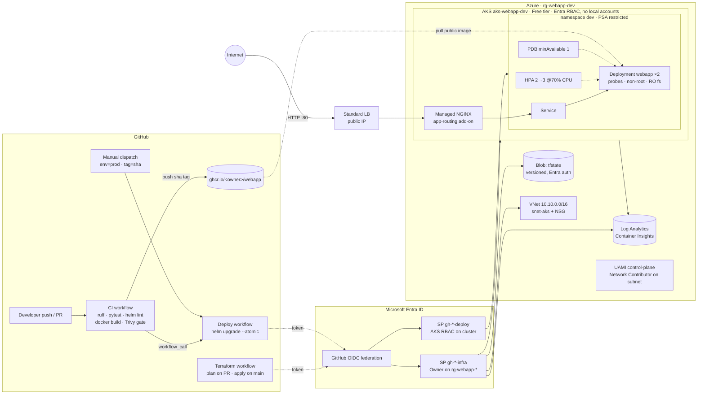
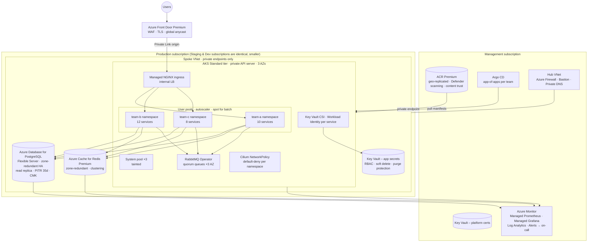

# Architecture

## 1. What is deployed by this repository (dev)

Key properties:

| Concern | Implementation |
|---|---|
| Reproducible infra | `infra/modules/{network,aks,platform}` reused by `infra/envs/{dev,prod}`; only `terraform.tfvars` + `backend.hcl` differ |
| No secrets in repo or CI | GitHub OIDC → Entra federated credentials; AKS local accounts disabled; state storage uses Entra auth only (`--allow-shared-key-access false`) |
| Least privilege | Separate infra vs deploy identities; infra scoped to the workload RG (not subscription); deploy has AKS data-plane roles only |
| Availability | 2 replicas, rolling update `maxUnavailable: 0`, PDB, startup/readiness/liveness probes, `preStop` drain, cluster autoscaler 1→2 |
| Scalability | HPA on CPU (2→3 dev, 3→12 prod); topology spread (soft in dev, hard in prod) |
| Safe delivery | Image built once, tagged by git SHA; Trivy gate; `helm --atomic` auto-rollback; post-deploy smoke test with rollback; prod behind environment approval |

## 2. Target architecture: 30 microservices, 3 environments, 99.9 %

### Major decisions and why

| Decision | Rationale | Trade-off |
|---|---|---|
| **One cluster per environment, one subscription per environment** | Blast-radius and quota isolation; RBAC and cost boundaries are explicit; prod upgrades rehearsed in staging with identical Terraform | 3× control planes / add-ons to operate; mitigated by identical IaC |
| **Single region, 3 availability zones** | 99.9 % = 43 min/month budget. Zone-redundant AKS, PostgreSQL HA and Redis cover datacenter failure; regional failover is not required for this SLO | Region-wide outage is accepted risk; documented DR: geo-restore of PostgreSQL + `terraform apply` in paired region (RTO hours) |
| **Namespaces per team, Argo CD app-of-apps** | 30 services × 3 envs = 90 deployments; GitOps keeps desired state in Git, drift-corrected, auditable; teams own their namespace, platform owns cluster | Learning curve; needs a clear repo/branch promotion model (image tag bumps via PR) |
| **Managed data services (PostgreSQL Flexible, Redis)** | Backups, HA, patching and encryption handled by Azure; ops team focuses on the platform | Higher unit cost than self-hosted; vendor coupling |
| **RabbitMQ Operator on AKS (quorum queues) vs Azure Service Bus** | Keeps AMQP semantics teams already rely on; operator handles clustering. Service Bus is the lower-ops alternative if protocol change is acceptable | Stateful workload on the cluster: needs zone-aware PVCs, PDBs and its own alerts |
| **Private everything** | Private API server, private endpoints for ACR/KV/PG/Redis, Front Door Private Link origin, Azure Firewall egress | Developer access via Bastion/VPN; CI runners must be self-hosted or use Front Door/private agents |
| **Workload Identity + Key Vault CSI** | No secrets in manifests or CI; each service gets its own Entra identity with least privilege to its own KV secrets and DB | Per-service identity bootstrap must be in Terraform to stay manageable |
| **Managed Prometheus/Grafana + Log Analytics + OpenTelemetry tracing** | Golden signals per service, SLO burn-rate alerts (p95 latency, error rate), traces to localise latency across 30 hops | Ingestion cost — sampling and log-level discipline needed |
| **Sensitive customer data** | Encryption at rest with customer-managed keys, TLS everywhere, PII confined to PostgreSQL with column-level access, audit logging (Postgres + Kubernetes audit), Defender for Containers, Azure Policy (no public LB, no privileged pods) | Compliance tooling adds friction to fast iteration in dev — enforce in staging/prod, audit-only in dev |
| **Capacity for ~500 rps** | Comfortable for a handful of D4s nodes per AZ; HPA on RPS/latency (KEDA) rather than CPU; PodDisruptionBudgets so upgrades never drop below quorum | Right-sizing needs load tests per service; cluster autoscaler headroom costs money |
